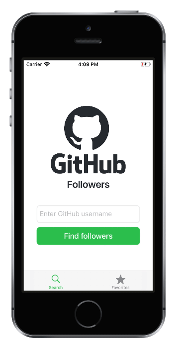
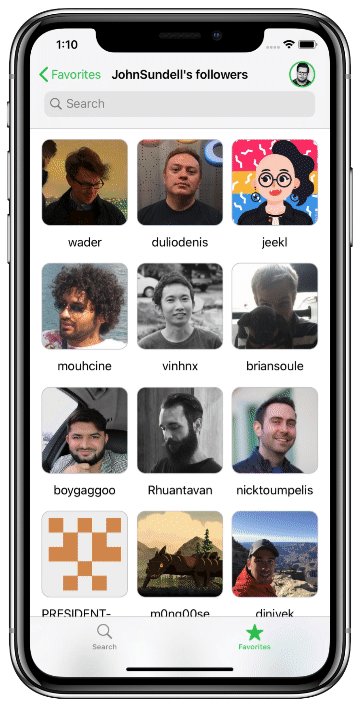
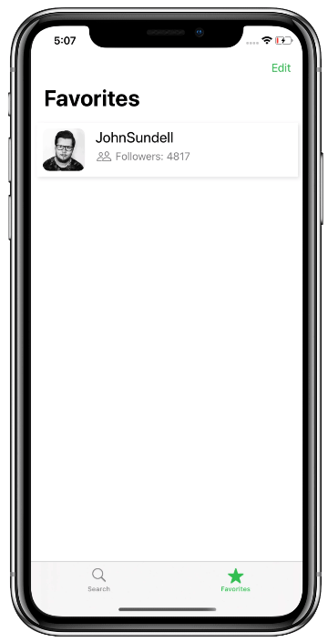

# GitHub Followers

Данное приложение написано на базе курса [“iOS Dev Job Interview Practice - Take Home Project”](https://seanallen.teachable.com/p/take-home) от Sean Allen, однако оригинальный курс является скорее вдохновляющим фактором, нежели источником кода.

Всё приложение было полностью переосмыслено, и переработано практически с нуля. Ни одна строчка кода из оригинального курса не совпадает с приложением в данном репозитории. Единственное, что использовалось – это основная идея, и картинки (assets).

Далее в описательной части бо́льшая часть внимания будет уделена именно отличиям оригинального, и данного приложений.

&nbsp;
### Основные моменты

* Вся программа выполнена в коде, без использования **Interface Builder**.
* Никаких сторонних библиотек.
* Для коллекций используется `UICollectionViewDiffableDataSource`, и `UICollectionViewCompositionalLayout`, а для таблиц – `UITableViewDiffableDataSource`.
* Там, где это целесообразно, используется реактивный фреймворк **Combine**.
* Поддерживаются светлая и тёмная темы.

&nbsp;
### Экран ввода имени пользователя

При активации поля ввода имени пользователя, происходит проверка, не перекроет ли появляющаяся клавиатура пользовательский интерфейс. В случае положительного ответа, весь экран сдвигается с анимацией вверх. Данная анимация синхронизирована с анимацией появления/исчезновения клавиатуры.

| iPhone X                                    | iPhone SE                                      |
| ------------------------------------------- | ---------------------------------------------- |
|  |  |

Было принято решение не блокировать кнопку поиска при отсутствии данных в поле ввода. Вместо этого, само поле ввода сообщает пользователю об ошибке при попытке совершения «пустого» поиска.

&nbsp;
### Список follower’ов

В качестве источника данных (data source), коллекция со списком follower’ов использует добавленный в iOS 13 класс `UICollectionViewDiffableDataSource`. Для layout’а данной коллекции также используется новый класс: `UICollectionViewCompositionalLayout`.
Использование diffable data source позволяет удобно фильтровать подписчиков через строку поиска. 

Любая сетевая загрузка данных индицируется соответствующей анимацией. При первоначальной загрузке коллекции анимация отображается посередине, а при подгрузке дополнительных данных – снизу. Все загружаемые из сети изображения также показывают анимацию загрузки.

Для загрузки картинок ячеек коллекций и таблиц используется новый реактивный фреймворк **Combine**, что позволяет удобно отменять загрузку в случае, если ячейка была переиспользована до момента полной загрузки картинки.

Все загруженные из сети данные (картинки, json) кэшируются. При этом не важно, были ли они загружены при помощи классического **URLSession dataTask**, или же при помощи **Combine**, – кэш единый в обоих случаях.

&nbsp;
### Информация о пользователе

Сверху, в строку навигации добавлена аватарка текущего пользователя. Данная аватарка является кнопкой, и при нажатии позволяет посмотреть информацию о данном пользователе GitHub.

Аналогично, нажатие на любого другого пользователя в списке follower’ов, открывает инфомрации о нём. При переключении на отображение follower’ов другого пользователя, все данные подгружаются в первоначальную коллекцию динамически.

&nbsp;
### Кнопка добавления в избранное

Пользователя можно отметить как избранного, нажав на звёздочку под его аватаркой. Анимация добавления и убирания из избранного выполнена при помощи **Core Animation**.

Данная «звёздочка» является кастомной кнопкой, которая отрисовывается в векторе кривыми Безье. При нажатии, кнопка проверяет своё текущее состояние, и анимирует его изменение путём перерисовки окружности, заполняющей границу, заданную формой кнопки.

Кнопка является максимально настраиваемой, и может быть переиспользована, т.к. позволяет в качестве параметров задавать:
* размер
* форму (кривую Безье)
* продолжительность анимации
* ширину границы
* цвет границы, цвет заднего слоя и цвет слоя выбора

&nbsp;
### Список избранных пользователей

При добавлении пользователя в список избранных, таблица с данным списком автоматически обновляет своё содержимое.

В списке избранных пользователей можно удалять, перемещать и сортировать пользователей. Все изменения происходят с соответствующими анимациями, а кнопка удаления содержит изображение.

&nbsp;
### Обработка «пустых» состояний

Программа отрабатывает «пустые» состояния. Если у выбранного пользователя нет фолловеров, либо же, если список избранных пользователей пуст, программа сообщит об этом.

При этом, если «пустое» состояние возникает в результате удаления последнего пользователя из списка избранных, то программа корректно обрабатывает и такое изменение тоже.

&nbsp;
### Отображение ошибок

При возникновении ошибки на любом экране приложения, возникает кастомное уведомление сверху.

<Gif

&nbsp;
### Адаптивность

Программа поддерживает тёмную тему.

<Jpg

Программа адаптируется под различные размеры экранов.

<Jpg
